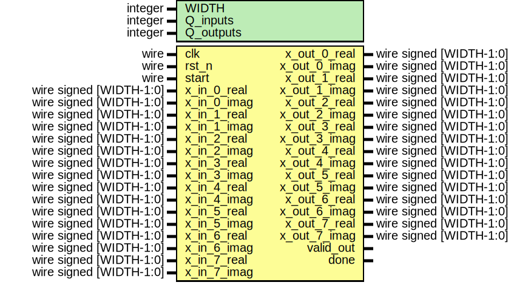

# Entity: fft_8point_top 
- **File**: fft_8point_top.v

## Diagram

## Generics

| Generic name | Type    | Value | Description |
| ------------ | ------- | ----- | ----------- |
| WIDTH        | integer | 16    |             |
| Q_inputs     | integer | 12    |             |
| Q_outputs    | integer | 11    |             |

## Ports

| Port name    | Direction | Type                    | Description |
| ------------ | --------- | ----------------------- | ----------- |
| clk          | input     | wire                    |             |
| rst_n        | input     | wire                    |             |
| start        | input     | wire                    |             |
| x_in_0_real  | input     | wire signed [WIDTH-1:0] |             |
| x_in_0_imag  | input     | wire signed [WIDTH-1:0] |             |
| x_in_1_real  | input     | wire signed [WIDTH-1:0] |             |
| x_in_1_imag  | input     | wire signed [WIDTH-1:0] |             |
| x_in_2_real  | input     | wire signed [WIDTH-1:0] |             |
| x_in_2_imag  | input     | wire signed [WIDTH-1:0] |             |
| x_in_3_real  | input     | wire signed [WIDTH-1:0] |             |
| x_in_3_imag  | input     | wire signed [WIDTH-1:0] |             |
| x_in_4_real  | input     | wire signed [WIDTH-1:0] |             |
| x_in_4_imag  | input     | wire signed [WIDTH-1:0] |             |
| x_in_5_real  | input     | wire signed [WIDTH-1:0] |             |
| x_in_5_imag  | input     | wire signed [WIDTH-1:0] |             |
| x_in_6_real  | input     | wire signed [WIDTH-1:0] |             |
| x_in_6_imag  | input     | wire signed [WIDTH-1:0] |             |
| x_in_7_real  | input     | wire signed [WIDTH-1:0] |             |
| x_in_7_imag  | input     | wire signed [WIDTH-1:0] |             |
| x_out_0_real | output    | wire signed [WIDTH-1:0] |             |
| x_out_0_imag | output    | wire signed [WIDTH-1:0] |             |
| x_out_1_real | output    | wire signed [WIDTH-1:0] |             |
| x_out_1_imag | output    | wire signed [WIDTH-1:0] |             |
| x_out_2_real | output    | wire signed [WIDTH-1:0] |             |
| x_out_2_imag | output    | wire signed [WIDTH-1:0] |             |
| x_out_3_real | output    | wire signed [WIDTH-1:0] |             |
| x_out_3_imag | output    | wire signed [WIDTH-1:0] |             |
| x_out_4_real | output    | wire signed [WIDTH-1:0] |             |
| x_out_4_imag | output    | wire signed [WIDTH-1:0] |             |
| x_out_5_real | output    | wire signed [WIDTH-1:0] |             |
| x_out_5_imag | output    | wire signed [WIDTH-1:0] |             |
| x_out_6_real | output    | wire signed [WIDTH-1:0] |             |
| x_out_6_imag | output    | wire signed [WIDTH-1:0] |             |
| x_out_7_real | output    | wire signed [WIDTH-1:0] |             |
| x_out_7_imag | output    | wire signed [WIDTH-1:0] |             |
| valid_out    | output    |                         |             |
| done         | output    |                         |             |

## Signals

| Name                    | Type             | Description |
| ----------------------- | ---------------- | ----------- |
| stage1_to_stage2_0_real | wire [WIDTH-1:0] |             |
| stage1_to_stage2_0_imag | wire [WIDTH-1:0] |             |
| stage1_to_stage2_1_real | wire [WIDTH-1:0] |             |
| stage1_to_stage2_1_imag | wire [WIDTH-1:0] |             |
| stage1_to_stage2_2_real | wire [WIDTH-1:0] |             |
| stage1_to_stage2_2_imag | wire [WIDTH-1:0] |             |
| stage1_to_stage2_3_real | wire [WIDTH-1:0] |             |
| stage1_to_stage2_3_imag | wire [WIDTH-1:0] |             |
| stage1_to_stage2_4_real | wire [WIDTH-1:0] |             |
| stage1_to_stage2_4_imag | wire [WIDTH-1:0] |             |
| stage1_to_stage2_5_real | wire [WIDTH-1:0] |             |
| stage1_to_stage2_5_imag | wire [WIDTH-1:0] |             |
| stage1_to_stage2_6_real | wire [WIDTH-1:0] |             |
| stage1_to_stage2_6_imag | wire [WIDTH-1:0] |             |
| stage1_to_stage2_7_real | wire [WIDTH-1:0] |             |
| stage1_to_stage2_7_imag | wire [WIDTH-1:0] |             |
| stage2_to_stage3_0_real | wire [WIDTH-1:0] |             |
| stage2_to_stage3_0_imag | wire [WIDTH-1:0] |             |
| stage2_to_stage3_1_real | wire [WIDTH-1:0] |             |
| stage2_to_stage3_1_imag | wire [WIDTH-1:0] |             |
| stage2_to_stage3_2_real | wire [WIDTH-1:0] |             |
| stage2_to_stage3_2_imag | wire [WIDTH-1:0] |             |
| stage2_to_stage3_3_real | wire [WIDTH-1:0] |             |
| stage2_to_stage3_3_imag | wire [WIDTH-1:0] |             |
| stage2_to_stage3_4_real | wire [WIDTH-1:0] |             |
| stage2_to_stage3_4_imag | wire [WIDTH-1:0] |             |
| stage2_to_stage3_5_real | wire [WIDTH-1:0] |             |
| stage2_to_stage3_5_imag | wire [WIDTH-1:0] |             |
| stage2_to_stage3_6_real | wire [WIDTH-1:0] |             |
| stage2_to_stage3_6_imag | wire [WIDTH-1:0] |             |
| stage2_to_stage3_7_real | wire [WIDTH-1:0] |             |
| stage2_to_stage3_7_imag | wire [WIDTH-1:0] |             |
| pipeline_counter        | reg [2:0]        |             |
| computation_active      | reg              |             |

## Processes
- unnamed: ( @(posedge clk or negedge rst_n) )
  - **Type:** always

## Instantiations

- stage1: fft_FirstStage
- stage2: fft_SecondStage
- stage3: fft_ThirdStage
