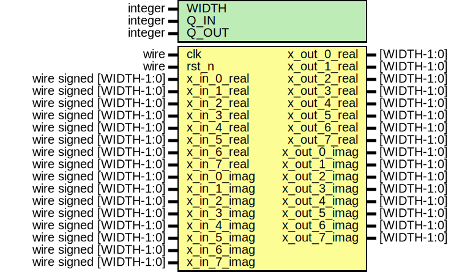

# Entity: fft_SecondStage 
- **File**: fft_SecondStage.v

## Diagram

## Generics

| Generic name | Type    | Value | Description |
| ------------ | ------- | ----- | ----------- |
| WIDTH        | integer | 16    |             |
| Q_IN         | integer | 12    |             |
| Q_OUT        | integer | 11    |             |

## Ports

| Port name    | Direction | Type                    | Description |
| ------------ | --------- | ----------------------- | ----------- |
| clk          | input     | wire                    |             |
| rst_n        | input     | wire                    |             |
| x_in_0_real  | input     | wire signed [WIDTH-1:0] |             |
| x_in_1_real  | input     | wire signed [WIDTH-1:0] |             |
| x_in_2_real  | input     | wire signed [WIDTH-1:0] |             |
| x_in_3_real  | input     | wire signed [WIDTH-1:0] |             |
| x_in_4_real  | input     | wire signed [WIDTH-1:0] |             |
| x_in_5_real  | input     | wire signed [WIDTH-1:0] |             |
| x_in_6_real  | input     | wire signed [WIDTH-1:0] |             |
| x_in_7_real  | input     | wire signed [WIDTH-1:0] |             |
| x_in_0_imag  | input     | wire signed [WIDTH-1:0] |             |
| x_in_1_imag  | input     | wire signed [WIDTH-1:0] |             |
| x_in_2_imag  | input     | wire signed [WIDTH-1:0] |             |
| x_in_3_imag  | input     | wire signed [WIDTH-1:0] |             |
| x_in_4_imag  | input     | wire signed [WIDTH-1:0] |             |
| x_in_5_imag  | input     | wire signed [WIDTH-1:0] |             |
| x_in_6_imag  | input     | wire signed [WIDTH-1:0] |             |
| x_in_7_imag  | input     | wire signed [WIDTH-1:0] |             |
| x_out_0_real | output    | [WIDTH-1:0]             |             |
| x_out_1_real | output    | [WIDTH-1:0]             |             |
| x_out_2_real | output    | [WIDTH-1:0]             |             |
| x_out_3_real | output    | [WIDTH-1:0]             |             |
| x_out_4_real | output    | [WIDTH-1:0]             |             |
| x_out_5_real | output    | [WIDTH-1:0]             |             |
| x_out_6_real | output    | [WIDTH-1:0]             |             |
| x_out_7_real | output    | [WIDTH-1:0]             |             |
| x_out_0_imag | output    | [WIDTH-1:0]             |             |
| x_out_1_imag | output    | [WIDTH-1:0]             |             |
| x_out_2_imag | output    | [WIDTH-1:0]             |             |
| x_out_3_imag | output    | [WIDTH-1:0]             |             |
| x_out_4_imag | output    | [WIDTH-1:0]             |             |
| x_out_5_imag | output    | [WIDTH-1:0]             |             |
| x_out_6_imag | output    | [WIDTH-1:0]             |             |
| x_out_7_imag | output    | [WIDTH-1:0]             |             |

## Signals

| Name                  | Type           | Description |
| --------------------- | -------------- | ----------- |
| x_flag_0_real_ext     | wire [WIDTH:0] |             |
| x_flag_0_imag_ext     | wire [WIDTH:0] |             |
| x_flag_1_real_ext     | wire [WIDTH:0] |             |
| x_flag_1_imag_ext     | wire [WIDTH:0] |             |
| x_flag_2_real_ext     | wire [WIDTH:0] |             |
| x_flag_2_imag_ext     | wire [WIDTH:0] |             |
| x_flag_3_real_ext     | wire [WIDTH:0] |             |
| x_flag_3_imag_ext     | wire [WIDTH:0] |             |
| x_flag_4_real_ext     | wire [WIDTH:0] |             |
| x_flag_4_imag_ext     | wire [WIDTH:0] |             |
| x_flag_5_real_ext     | wire [WIDTH:0] |             |
| x_flag_5_imag_ext     | wire [WIDTH:0] |             |
| x_flag_6_real_ext     | wire [WIDTH:0] |             |
| x_flag_6_imag_ext     | wire [WIDTH:0] |             |
| x_flag_7_real_ext     | wire [WIDTH:0] |             |
| x_flag_7_imag_ext     | wire [WIDTH:0] |             |
| x_flag_0_real_rounded | wire [WIDTH:0] |             |
| x_flag_0_imag_rounded | wire [WIDTH:0] |             |
| x_flag_1_real_rounded | wire [WIDTH:0] |             |
| x_flag_1_imag_rounded | wire [WIDTH:0] |             |
| x_flag_2_real_rounded | wire [WIDTH:0] |             |
| x_flag_2_imag_rounded | wire [WIDTH:0] |             |
| x_flag_3_real_rounded | wire [WIDTH:0] |             |
| x_flag_3_imag_rounded | wire [WIDTH:0] |             |
| x_flag_4_real_rounded | wire [WIDTH:0] |             |
| x_flag_4_imag_rounded | wire [WIDTH:0] |             |
| x_flag_5_real_rounded | wire [WIDTH:0] |             |
| x_flag_5_imag_rounded | wire [WIDTH:0] |             |
| x_flag_6_real_rounded | wire [WIDTH:0] |             |
| x_flag_6_imag_rounded | wire [WIDTH:0] |             |
| x_flag_7_real_rounded | wire [WIDTH:0] |             |
| x_flag_7_imag_rounded | wire [WIDTH:0] |             |

## Processes
- unnamed: ( @(posedge clk or negedge rst_n) )
  - **Type:** always
