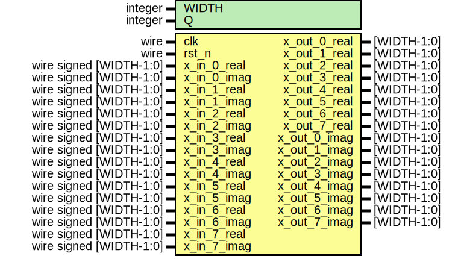

# Entity: fft_ThirdStage 
- **File**: fft_ThirdStage.v

## Diagram

## Generics

| Generic name | Type    | Value | Description |
| ------------ | ------- | ----- | ----------- |
| WIDTH        | integer | 16    |             |
| Q            | integer | 11    |             |

## Ports

| Port name    | Direction | Type                    | Description |
| ------------ | --------- | ----------------------- | ----------- |
| clk          | input     | wire                    |             |
| rst_n        | input     | wire                    |             |
| x_in_0_real  | input     | wire signed [WIDTH-1:0] |             |
| x_in_0_imag  | input     | wire signed [WIDTH-1:0] |             |
| x_in_1_real  | input     | wire signed [WIDTH-1:0] |             |
| x_in_1_imag  | input     | wire signed [WIDTH-1:0] |             |
| x_in_2_real  | input     | wire signed [WIDTH-1:0] |             |
| x_in_2_imag  | input     | wire signed [WIDTH-1:0] |             |
| x_in_3_real  | input     | wire signed [WIDTH-1:0] |             |
| x_in_3_imag  | input     | wire signed [WIDTH-1:0] |             |
| x_in_4_real  | input     | wire signed [WIDTH-1:0] |             |
| x_in_4_imag  | input     | wire signed [WIDTH-1:0] |             |
| x_in_5_real  | input     | wire signed [WIDTH-1:0] |             |
| x_in_5_imag  | input     | wire signed [WIDTH-1:0] |             |
| x_in_6_real  | input     | wire signed [WIDTH-1:0] |             |
| x_in_6_imag  | input     | wire signed [WIDTH-1:0] |             |
| x_in_7_real  | input     | wire signed [WIDTH-1:0] |             |
| x_in_7_imag  | input     | wire signed [WIDTH-1:0] |             |
| x_out_0_real | output    | [WIDTH-1:0]             |             |
| x_out_1_real | output    | [WIDTH-1:0]             |             |
| x_out_2_real | output    | [WIDTH-1:0]             |             |
| x_out_3_real | output    | [WIDTH-1:0]             |             |
| x_out_4_real | output    | [WIDTH-1:0]             |             |
| x_out_5_real | output    | [WIDTH-1:0]             |             |
| x_out_6_real | output    | [WIDTH-1:0]             |             |
| x_out_7_real | output    | [WIDTH-1:0]             |             |
| x_out_0_imag | output    | [WIDTH-1:0]             |             |
| x_out_1_imag | output    | [WIDTH-1:0]             |             |
| x_out_2_imag | output    | [WIDTH-1:0]             |             |
| x_out_3_imag | output    | [WIDTH-1:0]             |             |
| x_out_4_imag | output    | [WIDTH-1:0]             |             |
| x_out_5_imag | output    | [WIDTH-1:0]             |             |
| x_out_6_imag | output    | [WIDTH-1:0]             |             |
| x_out_7_imag | output    | [WIDTH-1:0]             |             |

## Signals

| Name             | Type               | Description |
| ---------------- | ------------------ | ----------- |
| mult_temp_1_real | wire [2*WIDTH-1:0] |             |
| mult_temp_1_imag | wire [2*WIDTH-1:0] |             |
| mult_temp_3_real | wire [2*WIDTH-1:0] |             |
| mult_temp_3_imag | wire [2*WIDTH-1:0] |             |
| mult_temp_5_real | wire [2*WIDTH-1:0] |             |
| mult_temp_5_imag | wire [2*WIDTH-1:0] |             |
| mult_temp_7_real | wire [2*WIDTH-1:0] |             |
| mult_temp_7_imag | wire [2*WIDTH-1:0] |             |
| x_flag_0_real    | wire [WIDTH-1:0]   |             |
| x_flag_1_real    | wire [WIDTH-1:0]   |             |
| x_flag_2_real    | wire [WIDTH-1:0]   |             |
| x_flag_3_real    | wire [WIDTH-1:0]   |             |
| x_flag_4_real    | wire [WIDTH-1:0]   |             |
| x_flag_5_real    | wire [WIDTH-1:0]   |             |
| x_flag_6_real    | wire [WIDTH-1:0]   |             |
| x_flag_7_real    | wire [WIDTH-1:0]   |             |
| x_flag_0_imag    | wire [WIDTH-1:0]   |             |
| x_flag_1_imag    | wire [WIDTH-1:0]   |             |
| x_flag_2_imag    | wire [WIDTH-1:0]   |             |
| x_flag_3_imag    | wire [WIDTH-1:0]   |             |
| x_flag_4_imag    | wire [WIDTH-1:0]   |             |
| x_flag_5_imag    | wire [WIDTH-1:0]   |             |
| x_flag_6_imag    | wire [WIDTH-1:0]   |             |
| x_flag_7_imag    | wire [WIDTH-1:0]   |             |

## Constants

| Name      | Type | Value     | Description |
| --------- | ---- | --------- | ----------- |
| w1_8_real |      | 1449      |             |
| w1_8_imag |      | -1449     |             |
| w2_8_real |      | 0         |             |
| w2_8_imag |      | -(1 << Q) |             |
| w3_8_real |      | -1449     |             |
| w3_8_imag |      | -1449     |             |

## Processes
- unnamed: ( @(posedge clk or negedge rst_n) )
  - **Type:** always
